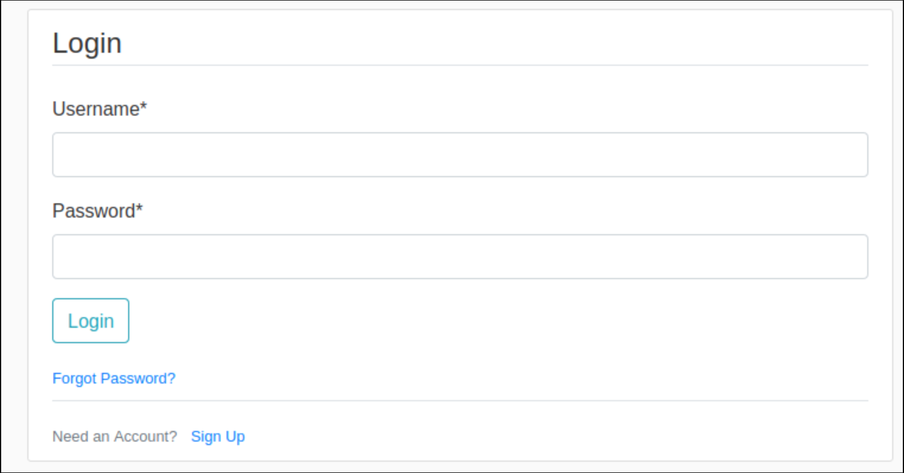
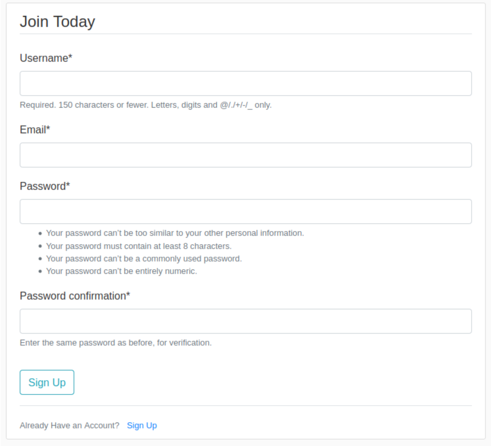
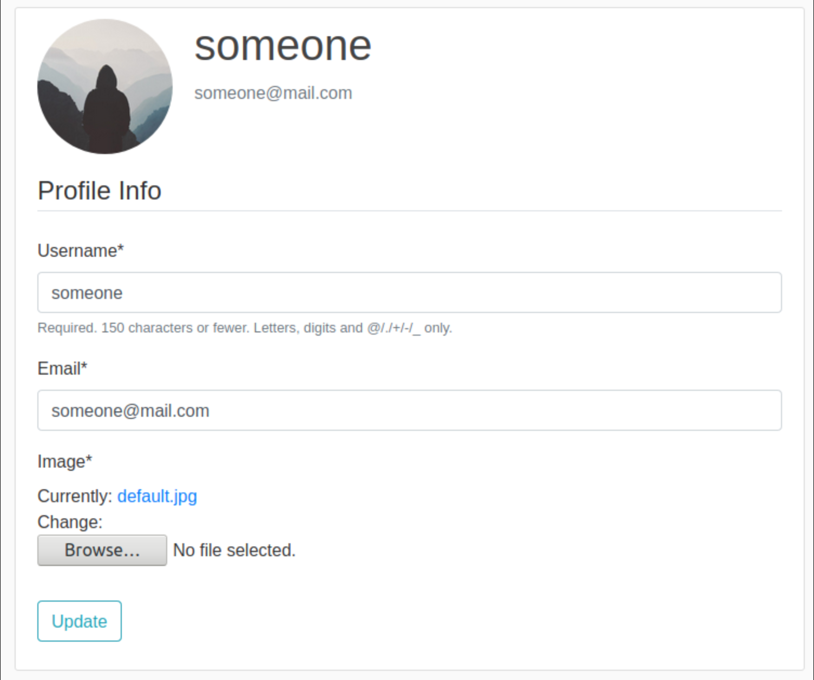
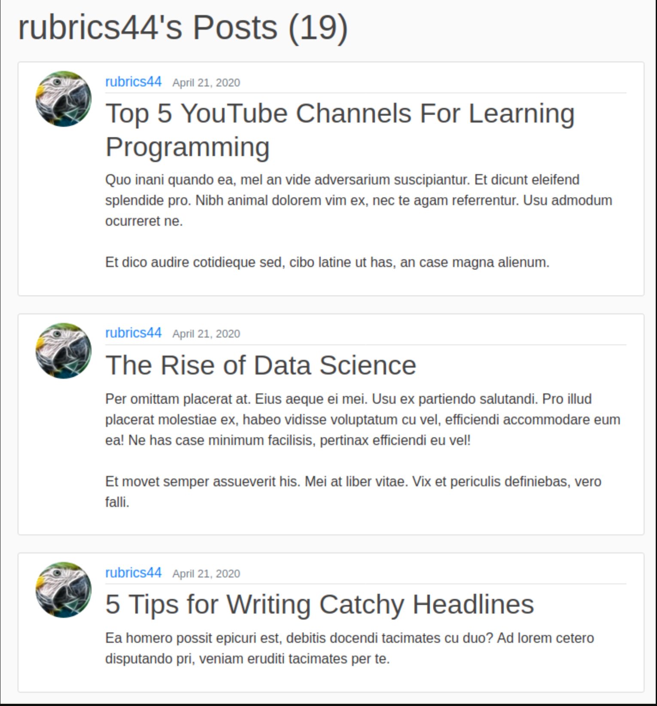
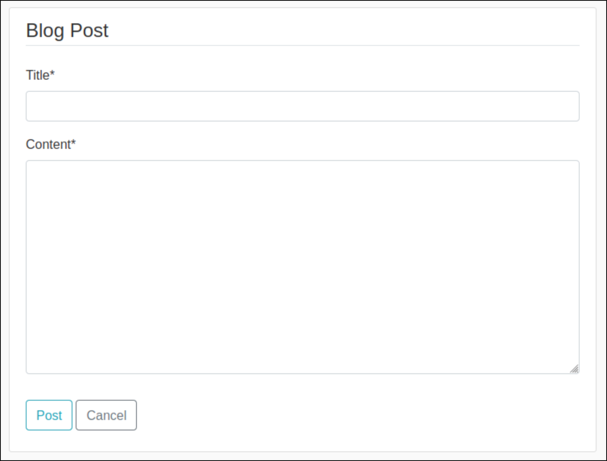
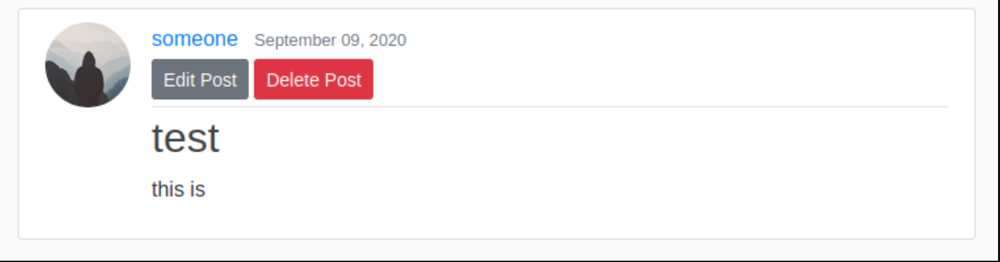
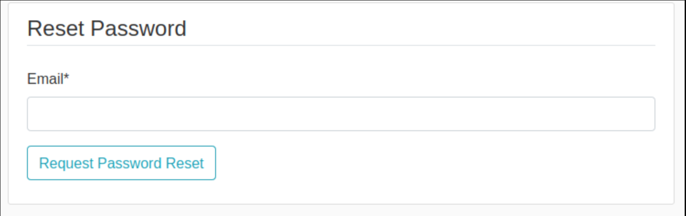

# Blogging-website# Django Blog App


## Features

**_Login or Create an Account_**

<div align='center'>
  
  
</div><br>

**_View and Customize Your Profile_**

<div align='center'>
  
</div><br>

**_View the Articles_**

<div align='center'>
  
</div><br>

**_View an Authors Articles_**

<div align='center'>
  
</div><br>

**_Create Your Own Articles_**

<div align='center'>
  
</div><br>

**_Articles are Paginated_**

<div align='center'>
  
</div><br>

**_Article Author can Edit or Delete Their Article_**

<div align='center'>
  
</div><br>

**_Users Password can be Reset_**

<div align='center'>
  
</div><br>

**_Secret Admin Panel to Manage Users and Articles_**

<div align='center'>
  
</div><br>


```


## Technologies Used

- Python
- Django
- SQL Database
- Django Crispy Forms
- Pillow Image Management

